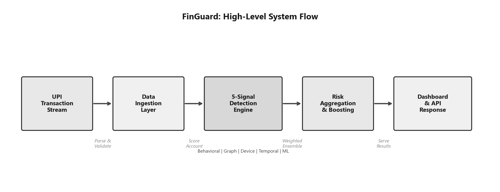
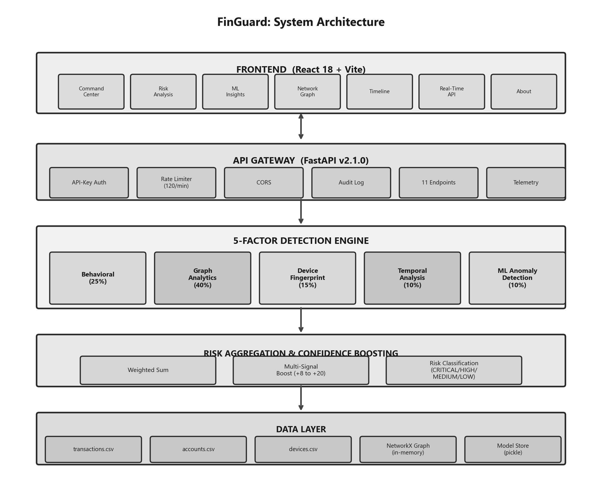
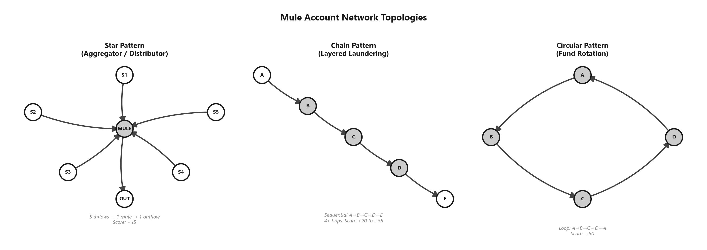
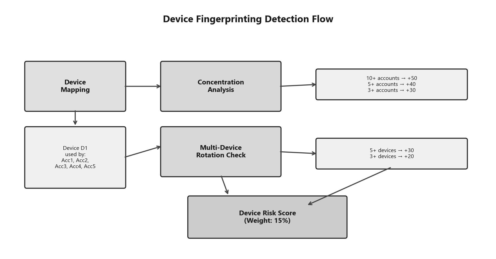
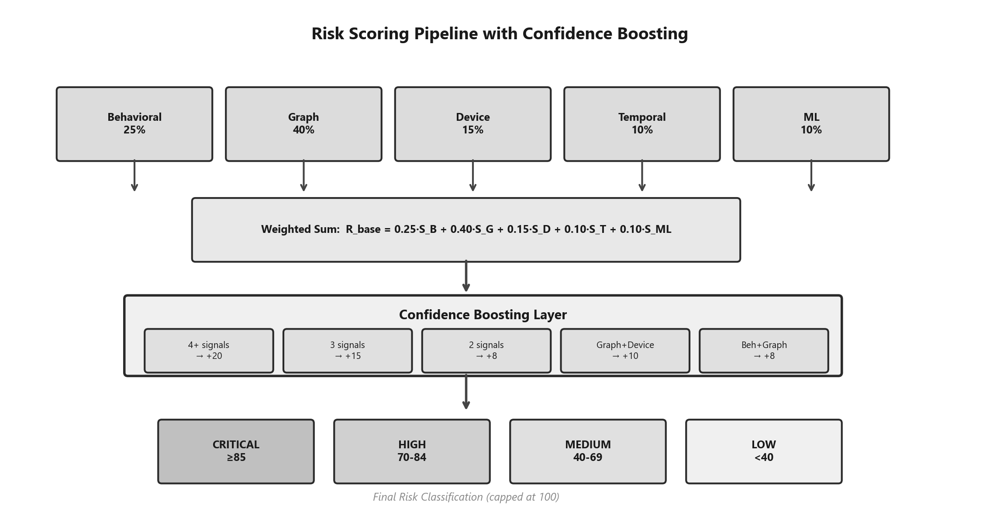
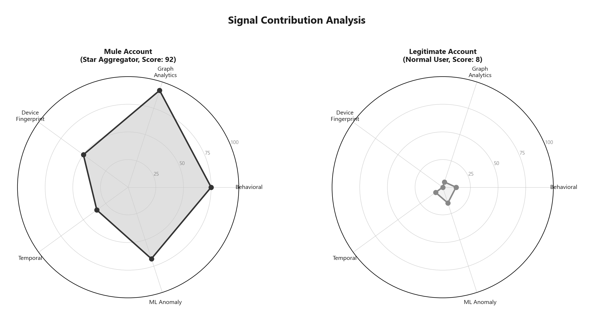
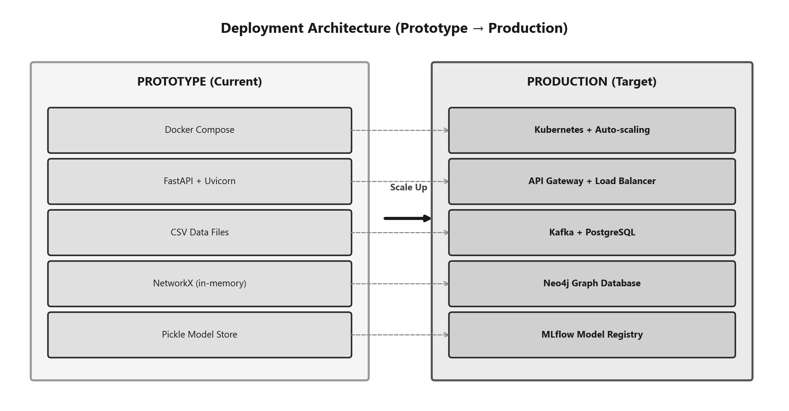
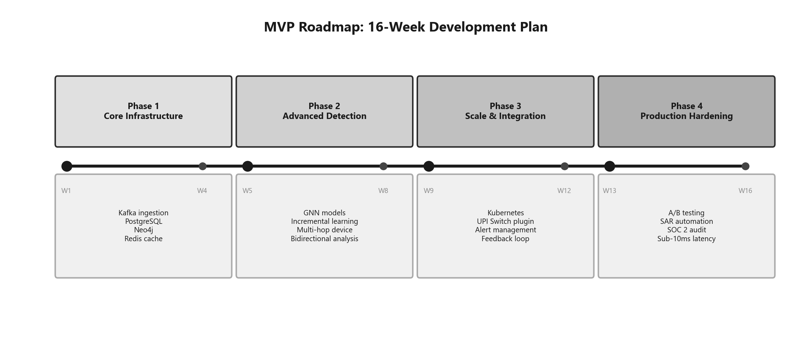
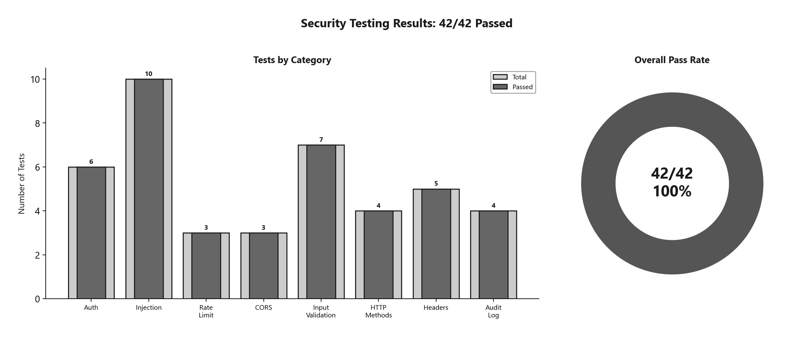

# Cyber Security Innovation Challenge 1.0

## PROTOTYPE DEVELOPMENT: Stage III

**Problem Statement Domain:** Mule Accounts & Collusive Fraud in UPI  
**Problem Statement:** Detection of Mule Account Networks and Coordinated Fund Laundering in UPI Payment Ecosystems  
**Project Subtitle:** FinGuard: Real-Time Multi-Signal Mule Account Detection System  
**Team Name:** FinGuard

---

### Project Links

| Resource | Link |
|----------|------|
| GitHub Repository | *[Insert GitHub Repo URL]* |
| Live Deployed URL | *[Insert Deployed URL]* |
| Dashboard Demo Video (YouTube) | *[Insert YouTube Link]* |
| Pitch Deck / Presentation | *[Insert Link if applicable]* |

---

| Role | Name | Institute | Enrolment No. | Email ID |
|------|------|-----------|---------------|----------|
| **Team Lead** | *[Name]* | *[Institute]* | *[Enrolment No.]* | *[Email]* |
| Member 2 | *[Name]* | *[Institute]* | *[Enrolment No.]* | *[Email]* |
| Member 3 | *[Name]* | *[Institute]* | *[Enrolment No.]* | *[Email]* |
| Member 4 | *[Name]* | *[Institute]* | *[Enrolment No.]* | *[Email]* |
| Member 5 | *[Name]* | *[Institute]* | *[Enrolment No.]* | *[Email]* |

---

## Index

1. [Project Overview and Team Details](#1-project-overview-and-team-details)
2. [Problem Statement and Background](#2-problem-statement-and-background)
3. [Literature Review / Existing Solutions](#3-literature-review--existing-solutions)
4. [Proposed Solution and Technical Architecture](#4-proposed-solution-and-technical-architecture)
5. [Innovation and Novelty Elements](#5-innovation-and-novelty-elements)
6. [Unique Selling Proposition (USP), Business Model, and Industry Relevance](#6-unique-selling-proposition-usp-vis-à-vis-existing-solutions-and-relevance-to-industry)
7. [Prototype Demonstration, Security Testing, and Deployment Details](#7-prototype-demonstration-and-real-world-deployment-details)
8. [Limitations and Challenges](#8-limitations-and-challenges)
9. [Roadmap Towards MVP](#9-roadmap-towards-mvp)
10. [Team Composition and Individual Contributions](#10-team-composition-and-individual-contributions)
11. [References](#11-references)

---

## 1. Project Overview and Team Details

### 1.1 Project Summary

FinGuard detects mule accounts in India's UPI ecosystem, and it does so in real time. Mule accounts are bank accounts that criminals use as intermediaries for laundering stolen money. They represent a significant challenge for the payments industry because each individual transaction through a mule appears perfectly legitimate. It is only when the broader context is examined (the network structure, the timing, the devices involved) that the fraud becomes visible.



*Figure 0: FinGuard high-level system flow, from transaction ingestion to dashboard output.*

Our system addresses this through a five-signal ensemble. It combines behavioral profiling, transaction graph analysis, device fingerprinting, temporal pattern detection, and unsupervised ML into a single scoring pipeline. The design principle is that even if a sophisticated mule operator manages to evade one detection signal, the remaining four will still identify the activity.

### 1.2 Objective

We set out to build a working prototype with four concrete goals:

1. **Detect** mule accounts by crunching transaction patterns, network topology, device correlations, and timing anomalies, all at once rather than one at a time.
2. **Classify** every account into a risk tier (CRITICAL, HIGH, MEDIUM, or LOW) and back that up with specific, readable evidence. No black-box scores.
3. **Visualize** the fraud networks on an interactive dashboard so that human investigators can actually make sense of what's going on and take action.
4. **Stay fast.** Sub-50ms scoring per account. UPI operates in real time, and the detection system must match that pace.

### 1.3 Scope

The prototype covers the full pipeline end-to-end:

- **Data Ingestion:** We use synthetic but realistic UPI transaction data that covers six different fraud scenarios: star aggregation, circular networks, chain laundering, device rings, rapid onboarding fraud, and night-time smurfing. More on these later.
- **Detection Engine:** Five independent scoring modules feed into a weighted ensemble with confidence boosting when multiple signals agree.
- **REST API:** 11 endpoints with API-key auth, rate limiting (120 req/min), structured audit logs, and telemetry baked in.
- **Dashboard:** An 8-tab React SPA covering command center, risk analysis, ML insights, network graph, timeline, alerts, live API testing, and an about page.
- **Deployment:** Docker containers with multi-service orchestration. We run as non-root, have health checks, the works.

### 1.4 Team Details

**Team Name:** FinGuard

Our team of five split the work roughly along these lines:

| Member | Role | Institute | Key Contribution |
|--------|------|-----------|------------------|
| *[Team Lead Name]* | Team Lead | *[Institute]* | System architecture, risk engine design, project coordination |
| *[Member 2]* | Backend Developer | *[Institute]* | Detection modules, API development, ML pipeline |
| *[Member 3]* | Frontend Developer | *[Institute]* | React dashboard, data visualization, UX design |
| *[Member 4]* | Data Engineer | *[Institute]* | Data generation, testing, validation scenarios |
| *[Member 5]* | DevOps / Documentation | *[Institute]* | Docker deployment, security hardening, documentation |

In practice, the boundaries between roles were fluid, with all members contributing across modules as the project demanded.

---

## 2. Problem Statement and Background

### 2.1 Context: The UPI Ecosystem

UPI is enormous. In October 2024 alone, it processed 13.1 billion transactions worth ₹20.64 lakh crore [1]. That makes it the largest real-time payment system in the world. The core design philosophy behind UPI centers on speed and accessibility: instant transfers, near-zero cost, and interoperability between banks. This has had a significant positive impact on financial inclusion across India.

However, that same openness creates a problem. A system that enables anyone to transfer money to anyone instantly also presents a highly attractive surface for criminal exploitation.

### 2.2 The Mule Account Problem

A mule account is a bank account used as an intermediary for laundering stolen funds. A victim is defrauded through phishing or a vishing call, and the stolen money is transferred into a mule account. From there, it is redistributed through additional intermediary accounts until it is withdrawn at an untraceable endpoint. The account holder may or may not be aware of their involvement; in some cases they are recruited through fraudulent job postings, while in others they have no knowledge of the activity.

Several characteristics make mule detection particularly challenging:

1. **Individual transactions look fine.** A ₹5,000 UPI transfer from one valid account holder to another? Nothing suspicious about that on its own. Standard amount, real person, normal-looking pattern.
2. **The fraud is in the coordination.** Mule operations create distinctive network shapes (star patterns where money aggregates into one node, sequential chains, circular loops) but these patterns are invisible when examining only individual transactions.
3. **Temporal patterns are a reliable but subtle indicator.** Mule accounts often show burst activity (a flurry of transactions in minutes) followed by total silence, or they operate mostly between midnight and 5 AM. The signatures are present, but they require targeted analysis to identify.
4. **Device sharing is a strong indicator of mule activity.** When five different bank accounts are all being operated from the same phone, this pattern is highly indicative of coordinated mule operations. However, traditional per-account monitoring will not detect this because it never correlates across accounts.

### 2.3 Limitations of Current Approaches

Most fraud detection systems operating within UPI today are fundamentally rule engines. They check each transaction against a list of thresholds. Amount too large? Flag it. Too many transactions in an hour? Block. Account on a blacklist? Reject.

These are effective to a degree. However, they have several fundamental blind spots:

- **They cannot detect network patterns.** Each transaction is evaluated in isolation. A rule engine has no concept of "this account just received money from five accounts and immediately sent it all to one other account." It processes five separate incoming transfers and one outgoing, each appearing legitimate individually.
- **Rules go stale.** Mule operators adapt fast. By the time a fraud team manually writes a new rule to catch the latest tactic, the criminals have moved on to something else.
- **Binary decision-making.** The system either blocks the transaction or allows it. There is no graduated response such as "this is 72% suspicious, escalate for review." This lack of nuance forces operators to choose between catching fraud and disrupting legitimate customers.
- **No cross-signal reasoning.** A rule engine cannot combine the fact that an account has anomalous transaction timing AND shares a device with three other accounts AND sits at the centre of a star-shaped transaction graph. This type of multi-dimensional reasoning is not achievable with threshold rules.

The RBI clearly recognises how serious this has gotten. They've mandated enhanced fraud monitoring under the Digital Payments Security Controls directions [2], and NPCI's own guidelines now push for real-time, multi-dimensional detection capabilities [3]. The regulatory pressure is real.

### 2.4 Problem Formulation

The problem can be stated formally as follows. Given a set of UPI accounts $A = \{a_1, a_2, \ldots, a_n\}$, we construct a transaction graph $G = (A, E)$ where each edge $e_{ij} \in E$ represents a fund transfer from $a_i$ to $a_j$. The objective is to compute a risk score $R(a_i) \in [0, 100]$ for every account:

$$R(a_i) = \sum_{k=1}^{5} w_k \cdot S_k(a_i) + \text{Boost}(\{S_k(a_i)\})$$

The five $S_k$ terms correspond to our five detection signals (behavioral, graph, device, temporal, ML). Each has a weight $w_k$. The Boost function is a confidence amplifier that rewards agreement across signals. When three or four independent detectors all flag the same account, the overall confidence in the detection increases substantially.

---

## 3. Literature Review / Existing Solutions

### 3.1 Rule-Based Systems

The dominant approach to UPI fraud detection today remains rule engines embedded within the payment switch. These are conceptually straightforward: set thresholds on transaction amounts, cap the velocity (for example, no more than 20 transactions per hour), maintain blacklists and whitelists, and act accordingly. They are fast, explainable, and effective for catching obvious fraud. However, coordinated multi-account fraud represents a significant blind spot. A rule engine does not cross-reference accounts against each other, so it cannot detect that five seemingly unrelated accounts are all funnelling money to the same destination [4].

### 3.2 Machine Learning Approaches

Standard machine learning models have been applied to banking fraud detection, including Random Forests, Gradient Boosting, and deep neural networks [5]. While these can be effective in broader fraud detection, they encounter specific challenges in the context of mule account identification:

- **Absence of labelled data.** Mule accounts are almost never explicitly labelled in production data. A supervised classifier cannot be trained without ground truth. This is the single biggest practical obstacle.
- **Concept drift is severe.** Mule tactics evolve continuously. A model trained on patterns from the previous quarter may be ineffective within weeks.
- **Individual account focus.** Most ML models consume a feature vector per transaction or per account. They cannot capture the relational network structure that constitutes the defining signature of mule operations.

### 3.3 Graph-Based Detection

Graph approaches represent a particularly promising direction in the recent literature. Several papers warrant specific discussion:

- Jambhrunkar et al. (2025) built MuleTrack, a lightweight temporal learning framework that tracks how account behavior transitions over time using sequential patterns [6]. A notable approach, though it does not incorporate device signals.
- Cheng et al. (2024) did a thorough review of GNNs for financial fraud and showed that graph-based methods consistently outperform traditional feature-based classifiers when it comes to coordinated fraud [7]. This is consistent with expectations, as network phenomena inherently require network-aware detection methods.
- Caglayan and Bahtiyar (2022) used Node2Vec embeddings for money laundering detection [8]. Their key finding: structural features extracted from the transaction graph improved detection rates substantially over using only per-transaction features.
- Huang (2025) approached the problem from a community detection perspective, identifying money mules by analysing graph communities and structural features [9].
- Neo4j (2023) published industry case studies on using their graph database for fraud detection in financial institutions [10]. These are valuable for understanding the gap between academic methods and operational deployment.

### 3.4 Unsupervised Anomaly Detection

Isolation Forest [11] merits specific discussion. The core intuition behind it is elegant: anomalies are few and different, so they can be isolated by random binary splits much more quickly than normal data points. No labelled examples are required; the algorithm identifies data points that deviate from the norm. Combined with simpler statistical methods like Z-score outlier detection, this produces an ensemble capable of detecting novel fraud patterns it has not been explicitly trained on. For mule detection, where labelled training data is often unavailable, this is a significant advantage.

### 3.5 Gap Analysis

We did a systematic comparison to figure out where the gaps are:

| Capability | Rule-Based | Supervised ML | Graph Methods | **FinGuard (Ours)** |
|------------|:----------:|:-------------:|:-------------:|:-------------------:|
| Temporal Pattern Detection | Static thresholds | Limited | None | Full (5 sub-signals) |
| Network/Graph Analysis | None | None | Yes | Yes (3 patterns + DFS) |
| Device Correlation | None | Partial | None | Full (concentration + rotation) |
| Unsupervised (No labels) | N/A | No | Partial | Yes (IF + Z-score) |
| Real-Time Scoring | Fast | Moderate | Slow | Fast (<50ms) |
| Explainability | Clear | Black-box | Limited | Full (3–5 evidence items) |
| Multi-Signal Ensemble | No | No | No | Yes (5-factor weighted) |
| Confidence Boosting | No | No | No | Yes (multi-signal correlation) |

Table 1: Comparison of FinGuard with existing detection approaches.

In summary, no existing system has combined all five signal types (behavioral, graph, device, temporal, ML) into one ensemble with explainable evidence and confidence-aware boosting. This is the gap that FinGuard addresses.

---

## 4. Proposed Solution and Technical Architecture

### 4.1 Overall Architecture

We adopted a layered architecture because it is well-suited to this domain. Each layer performs one function and performs it well. Data enters at the bottom, is processed through five parallel scoring modules, aggregated into a final risk score, served through an API, and displayed on a dashboard. The complete architecture is shown below:

```
┌─────────────────────────────────────────────────────────────┐
│                   Frontend (React + Vite)                    │
│   Command Center │ Risk Analysis │ ML Insights │ Network     │
│   Timeline │ Alerts │ Real-Time API │ About                  │
├─────────────────────────────────────────────────────────────┤
│                  API Gateway (FastAPI v2.1.0)                 │
│   API-Key Auth │ Rate Limiter (120/min) │ CORS │ Audit Log   │
│   11 REST Endpoints │ Telemetry Middleware                    │
├─────────────────────────────────────────────────────────────┤
│              5-Factor Detection Engine                        │
│  ┌──────────┐ ┌──────────┐ ┌──────────┐ ┌────────┐ ┌─────┐ │
│  │Behavioral│ │  Graph   │ │  Device  │ │Temporal│ │ ML  │ │
│  │  (25%)   │ │  (40%)   │ │  (15%)   │ │ (10%)  │ │(10%)│ │
│  └──────────┘ └──────────┘ └──────────┘ └────────┘ └─────┘ │
├─────────────────────────────────────────────────────────────┤
│          Risk Aggregation & Confidence Boosting               │
│   Weighted Sum → Multi-Signal Boost (+8 to +20) → Classify   │
├─────────────────────────────────────────────────────────────┤
│                    Data Layer                                 │
│   transactions.csv │ accounts.csv │ devices.csv               │
│   NetworkX Graph (in-memory) │ Model Store (pickle)           │
└─────────────────────────────────────────────────────────────┘
```

Figure 1: System Architecture for FinGuard Mule Account Detection Platform.



*Figure 1b: High-resolution layered architecture diagram.*

The important design principle is that the five detection modules all run independently. They do not communicate with one another. This is a deliberate design choice to ensure uncorrelated signals, so that the confidence boosting at the aggregation layer carries genuine statistical weight.

### 4.2 Detection Methodology

This is the heart of the system. Each module is described in detail below.

#### 4.2.1 Behavioral Analysis (Weight: 25%)

The behavioral module looks at each account's transaction patterns individually and asks: does this look like a mule? It checks six things:

1. **Velocity Detection:** Transaction count per account. 10 or more transactions receives a score of 35. 5 or more receives 25. Elevated transaction frequency is a relevant indicator for accounts purportedly used for routine personal transactions.
2. **Asymmetric Flow Analysis:** We calculate the pass-through ratio, which is essentially outflow divided by inflow. If that ratio sits between 0.8 and 1.2, the account is forwarding almost everything it receives. This is classic mule behaviour, contributing +35.
3. **Amount Anomalies:** Unusually high average amounts (over ₹5,000) add +20. Single transactions above ₹10,000 add +15. These are not conclusive individually but contribute to the overall score.
4. **New Account + Rapid Activity:** This is a strong indicator of mule activity. An account less than 7 days old that already has 2+ transactions scores +40. Mule operators frequently open fresh accounts, use them quickly, and discard them.
5. **Total Volume Spikes:** If cumulative volume exceeds ₹50,000, that adds +20.
6. **Unidirectional Flow:** Accounts exhibiting only outbound transfers with no incoming funds are considered anomalous. +20.

We cap each sub-score at 100 to prevent unbounded accumulation.

#### 4.2.2 Graph Analytics (Weight: 40%)

This module receives the highest weight because mule operations are inherently network-level problems. A mule account may exhibit perfectly ordinary individual transactions, but its connectivity pattern within the transaction graph reveals distinctive structural anomalies.

We build a directed graph $G = (V, E)$ using NetworkX where accounts are nodes and UPI transfers are edges. Then we hunt for three specific topologies:



*Figure 2: The three mule network topologies detected by the graph analytics module.*

**Star Pattern (Aggregator/Distributor):**
Consider a central node with substantial money flowing in from many sources and draining out to one destination (or the reverse). This pattern indicates fund aggregation or distribution.
- 5 or more inflows funnelling to 1 outflow: +45 (textbook aggregator)
- 3+ inflows to 1 outflow: +30 (still looks like a star)
- 1 inflow splitting to 5+ outflows: +45 (distributor pattern)

**Chain Pattern (Layered Laundering):**
Money moves A to B to C to D to E in a straight line, each intermediary taking a cut or simply passing it along. We detect these chains using BFS with a depth limit to avoid excessive computation:
- Chain 6+ hops deep: +35 (deep laundering chain)
- 5 hops: +30
- 4 hops: +20

**Circular Pattern (Fund Rotation):**
This is where money loops back to where it started after bouncing through several accounts. We wrote a custom DFS cycle detector with a depth cap of 6, having specifically avoided using `nx.simple_cycles` because its worst-case complexity is exponential--disastrous on a dense transaction graph.
- Account participates in a cycle of length 3–6: +50

Our cycle detection runs in $O(V \cdot d)$ where $d$ is the depth limit. This is significantly more tractable. During batch scoring, cycle membership is computed once for the entire graph, and each account's score is then a dictionary lookup at $O(1)$.

#### 4.2.3 Device Fingerprinting (Weight: 15%)

If ten accounts are all logging in from the same device, something is very wrong. No legitimate user has ten bank accounts on one phone. This module exploits that intuition:

- **Device Concentration:** An account sharing a device with 10+ other accounts gets +50. With 5+ accounts, +40. With 3+ accounts, +30.
- **Multi-Device Rotation:** Conversely, if a single account is being accessed from 5 or more different devices, this is also suspicious (possible device spoofing). Score: +30. Three or more devices receives +20.

Device data turned out to be surprisingly powerful in practice. It catches things the other modules miss entirely.



*Figure 3: Device fingerprinting detection flow and scoring thresholds.*

#### 4.2.4 Temporal Analysis (Weight: 10%)

Time-based signals are subtle but revealing. Human transaction patterns differ significantly from automated ones, and mule operations often exhibit a distinct temporal fingerprint:

1. **Burst Detection:** Three or more transactions within 60 seconds is almost certainly automated. That earns +35. Three or more within 5 minutes is still suspicious: +25.
2. **Odd-Hour Activity:** If over half an account's transactions happen between midnight and 5 AM (and there are at least 3 night transactions), this is a significant indicator. Legitimate users rarely conduct UPI transfers at 3 AM. Score: +30.
3. **Velocity Spikes:** We split the account's activity timeline in half. If the second half has 3x more transactions than the first half, that sudden acceleration is worth +25.
4. **Weekend Concentration:** More than 70% of transactions falling on weekends, with at least 4 weekend transactions, adds +15. Not as strong a signal but still contributory.
5. **Uniform Timing (Bot Signature):** This is a particularly effective detection rule. We compute the coefficient of variation (CV) of the time gaps between consecutive transactions. A CV below 0.15 with a mean gap under 600 seconds means the transactions are spaced almost perfectly evenly, which is strongly indicative of automated rather than human activity. +30.

#### 4.2.5 ML Anomaly Detection (Weight: 10%)

The ML module provides unsupervised anomaly detection. We deliberately implemented our own Isolation Forest rather than importing scikit-learn's, partly to reduce the dependency footprint and partly to maintain full control over the implementation.

**Feature Engineering:** We extract 17 features per account. Some are straightforward (transaction counts, amounts sent and received, averages). Others require additional computation:
- Transaction counts: total, sent, received
- Amount statistics: total sent/received, average, max, standard deviation
- Network metrics: unique senders, unique receivers, pass-through ratio, degree ratio
- Account metadata: age in days
- Device metrics: device count, how many other accounts share those devices
- Derived metrics: transactions per day, volume per day

**Isolation Forest (Custom Implementation):**
About 200 lines of pure NumPy. We train 100 trees, each sampling up to 256 data points. The algorithm constructs random binary trees by picking random features and random split values. Anomalous data points get isolated quickly (short path lengths). Normal points take more splits. The score formula:

$$S_{IF}(x) = 2^{-\frac{E[h(x)]}{c(n)}}$$

$E[h(x)]$ is the average path length across all trees; $c(n)$ is the expected path length for an unsuccessful BST search on $n$ elements. Higher scores mean more anomalous.

**Z-Score Ensemble:** We also run a statistical Z-score detector in parallel. The final ML score blends both:

$$S_{ML} = 0.7 \cdot S_{IF} + 0.3 \cdot S_{Z\text{-score}}$$

70/30 split. We experimented extensively with these weights and this ratio captured the desired behaviour. The Isolation Forest handles the primary detection, while the Z-score captures the straightforward statistical outliers that the forest sometimes ranks lower.

**Explainability:** We implemented permutation-based feature importance to show which features matter most globally. For individual accounts, we generate SHAP-like local explanations listing the top 5 features driving that account's anomaly score. Investigators need to understand *why* an account is flagged, not merely *that* it is flagged.

**Model Persistence:** Trained models are serialised to disk with a JSON sidecar containing training timestamps, feature names, and hyperparameters. This is sufficient to reproduce results at a later stage.

### 4.3 Risk Aggregation and Confidence Boosting

All five signals feed into a weighted sum:

$$R_{\text{base}} = 0.25 \cdot S_B + 0.40 \cdot S_G + 0.15 \cdot S_D + 0.10 \cdot S_T + 0.10 \cdot S_{ML}$$

In addition to the base score, we apply confidence boosts when multiple independent signals agree. The reasoning is straightforward: if three out of five detectors all flag the same account, the probability of a genuine threat increases substantially compared to a single detector flagging it.

| Active Signals | Boost |
|:--------------:|:-----:|
| ≥4 signals above threshold | +20 |
| ≥3 signals above threshold | +15 |
| ≥2 signals above threshold | +8 |
| Graph ≥30 AND Device ≥15 | +10 |
| Behavioral ≥30 AND Graph ≥30 | +8 |
| Behavioral ≥40 AND Graph ≥40 AND Device ≥30 | +12 |

Table 2: Multi-signal confidence boosting rules.

Final score: $R = \min(R_{\text{base}} + \text{Boost}, 100)$. The score is capped at 100. Accounts are then classified into risk levels:

| Risk Level | Score Range | Recommended Action |
|:----------:|:----------:|:------------------:|
| CRITICAL | ≥85 | Block immediately, freeze account, file SAR |
| HIGH | 70–84 | Manual investigation within 24 hours |
| MEDIUM | 40–69 | Add to watchlist, periodic review |
| LOW | <40 | Allow, routine monitoring |

Table 3: Risk classification thresholds and recommended actions.



*Figure 4: Complete risk scoring pipeline with weighted aggregation and confidence boosting.*

CRITICAL accounts require immediate attention, specifically account-level freezing. HIGH means manual investigation within 24 hours. MEDIUM accounts are placed on a watchlist. LOW represents business as usual.

### 4.4 API Layer

The backend runs on FastAPI v2.1.0 and exposes 11 endpoints, covering scoring, batch scoring, simulation, dashboard data, graph data, timeline data, report generation, metrics, health checks, and auto-generated Swagger docs:

| Endpoint | Method | Function |
|----------|--------|----------|
| `/score/{account_id}` | GET | Real-time single account scoring |
| `/batch_score` | POST | Batch scoring with graph & ML caching |
| `/simulate` | POST | Transaction simulation with dual-side risk |
| `/stats` | GET | System-wide risk distribution statistics |
| `/api/dashboard` | GET | Pre-computed dashboard data (all scores) |
| `/api/network` | GET | Graph nodes/edges for vis-network rendering |
| `/api/timeline` | GET | Transaction timeline and temporal heatmaps |
| `/api/report` | GET | Auto-generated Markdown investigation report |
| `/metrics` | GET | SRE/observability performance metrics |
| `/health` | GET | Container health check endpoint |
| `/docs` | GET | Interactive Swagger API documentation |

Table 4: REST API endpoint reference.

On the security side: every request needs an API key (X-API-Key header), we rate-limit at 120 requests per 60-second window per IP, CORS is locked down to specific origins (no wildcards, after we made that mistake once during development and learned our lesson), and every request gets logged as structured JSON with a unique request ID and response time.

### 4.5 Frontend Dashboard

The frontend is a React 18 + Vite single-page app with seven tabs. We went with a dark theme because, honestly, analysts staring at fraud dashboards for hours appreciate it.

1. **Command Center:** The landing page. Shows overall metrics at a glance: risk distribution, summary stats, a signal heatmap grid, cards for the riskiest accounts.
2. **Risk Analysis:** A searchable, filterable table of all accounts. Selecting any account shows the full forensic breakdown: per-signal scores, evidence items, confidence level, and recommended actions.
3. **ML Insights:** Visualises feature importance rankings and anomaly score distributions. Users can examine any specific account to see its SHAP-like explanation, identifying which features are driving its anomaly score.
4. **Network Graph:** This is typically the most compelling component during demonstrations. Interactive vis-network visualisation with nodes colour-coded by risk (red, orange, yellow, green). Risk-level filters allow isolation of suspicious clusters.
5. **Timeline:** Transaction timeline with hourly bucketing and a day-of-week × hour-of-day heatmap. Makes temporal patterns immediately visible.
6. **Real-Time API:** A built-in API testing interface. Users can score accounts, run simulations, and perform batch scoring directly from the dashboard without requiring external tools like Postman or curl.
7. **About:** Documentation, methodology explanation, architecture overview. We embedded this directly into the app so it travels with the deployment.

> **[Insert: Dashboard Screenshots from your running application here. Take a screenshot of each tab: Command Center, Risk Analysis, ML Insights, Network Graph, Timeline, Real-Time API, About.]**



*Figure 5: Signal contribution radar comparing a mule account vs a legitimate account across all five detection signals.*

---

## 5. Innovation and Novelty Elements

### 5.1 Five-Signal Ensemble Architecture

Most fraud detection systems identified during our research rely on one or two signals: rules alone, ML alone, or graph analysis alone. In the literature reviewed, no existing system combines all five signal types (behavioral, graph, device, temporal, and ML) into a single weighted ensemble. The advantage of this approach extends beyond broader coverage to operational redundancy. An adversary who manages to evade the behavioral checks would still need to simultaneously circumvent the graph analysis, device fingerprinting, temporal detector, and anomaly model. The probability of evading all five independent signals simultaneously is substantially lower than evading any single one.

### 5.2 Multi-Signal Confidence Boosting

The multi-signal confidence boosting mechanism is a key technical contribution of this system. When two signals both flag an account, the combined evidence is more significant than either signal alone. When four signals converge, the likelihood of a genuine threat is substantially higher. The boosting mechanism formalises this principle with additive score increments of +8 to +20, depending on how many independent signals agree. The independence of signals is critical: because the detection modules share no internals or intermediate state, agreement between them carries meaningful evidential weight. This follows the same principle as ensemble learning in ML, applied at the risk aggregation layer.

### 5.3 Zero-Label ML Detection

The Isolation Forest implementation was written from scratch in NumPy, comprising approximately 200 lines of code with no dependency on scikit-learn or other heavy ML frameworks. The core advantage of Isolation Forest is that it requires no labelled training data. It identifies anomalies by isolating data points that are statistically distinct from the rest of the population. For mule detection, this property is particularly valuable: the system can be deployed on an entirely new UPI platform from day one, with zero historical labelled fraud data, and begin flagging outliers immediately. This is a capability that supervised classifiers fundamentally cannot provide without pre-existing labelled datasets.

### 5.4 Efficient Graph Algorithms

This became apparent during early development when `nx.simple_cycles()` was called on the transaction graph. It performed acceptably on small test graphs, but on larger datasets, the function failed to terminate within a reasonable time due to its exponential worst-case complexity. To address this, we implemented a custom DFS-based cycle detector with a depth cap of 6, running in $O(V \cdot d)$ time. Similarly, for chain detection, we use BFS with depth limits instead of `nx.all_simple_paths()`. While these are not novel algorithmic contributions in isolation, the practical impact on real-time scoring performance is substantial.

### 5.5 Explainability by Design

Explainability was a design priority from the outset, integrated directly into the detection pipeline rather than added as a separate post-hoc layer. Each detection module generates 3–5 specific evidence items as part of its core logic, such as "Star-pattern mule behavior: 5 inflows → 1 outflow" or "Rapid-fire burst: 4 transactions within 60 seconds." When an investigator reviews an alert, the rationale for the flag is immediately visible, enabling informed decision-making. This is essential in regulated financial environments where opaque scoring is insufficient for compliance and audit requirements.

### 5.6 Production-Grade Security

Security was treated as a first-class requirement throughout development, unlike many academic prototypes where it is overlooked entirely. API-key authentication, per-IP rate limiting at 120 req/min, CORS restricted to specific origins (no wildcards), structured JSON audit logging with request IDs, non-root Docker execution. These are fundamental requirements for any system intended to operate in a production banking or PSP environment.

---

## 6. Unique Selling Proposition (USP) vis-à-vis Existing Solutions and Relevance to Industry

### 6.1 Key Differentiators

**1. Five signals where others use one or two.**
The typical UPI fraud system uses rules, or perhaps a single ML model. FinGuard integrates five independent detection signals. A concrete example illustrates why this matters: suppose a mule account has a moderately suspicious behavioral score (30) and a strong graph pattern (45). Neither score alone crosses typical alert thresholds. But our ensemble, with boosting activating because two signals agree, pushes the combined score to 68 or higher. That account is flagged. A single-model system would have missed it.

**2. We put graphs first.**
Graph analytics receives 40% of the total weight, the largest share of any signal. This is a deliberate architectural choice. Mule operations are, at their core, network operations. A behavioral anomaly might describe a suspicious individual. But only graph analysis can reveal the star pattern, the chain structure, the circular money loop that exposes an organized ring. Individual versus organisational detection: this is the key distinction.

**3. No training data required.**
This is a practical selling point that merits emphasis. Most ML-based fraud systems need months of labelled historical data before they can even begin operating. FinGuard does not. Our Isolation Forest runs unsupervised. Deploy it on a new platform, provide the current transaction data, and it begins identifying outliers immediately.

**4. Full explainability.**
Every score comes with component-level breakdowns, specific evidence items, confidence levels, and recommended actions. Compliance officers at banks require this level of detail. RBI regulations demand transparency in fraud monitoring. Providing only an opaque numerical score without supporting evidence is insufficient for regulatory compliance.

### 6.2 Industry Relevance

**For Banks and Payment Service Providers (PSPs):**
The most direct value is intercepting mule networks before the money is withdrawn. This translates directly to financial savings. Additionally, the pre-classified risk tiers and auto-generated evidence meaningfully reduce investigation time. Instead of an analyst manually piecing together transaction histories, they receive a ready-made dossier. The system also supports RBI compliance requirements for fraud monitoring and SAR filing.

**For NPCI and UPI Infrastructure:**
FinGuard offers something NPCI does not currently have at the infrastructure level: a network-wide view of mule operations. Individual banks can only see their own accounts. Our graph analysis can in principle span the entire ecosystem. Moreover, it operates within UPI's latency constraints, so it does not impact transaction processing speed.

**For Law Enforcement:**
The auto-generated investigation reports are designed with law enforcement in mind. They include structural evidence: network graphs showing exactly how money moved, temporal heatmaps showing when activity spiked, identification of the complete mule network rather than only the single account that triggered an alert. The audit logs are forensic-grade: timestamped, immutable, with unique request IDs.

### 6.3 Competitive Positioning

| Feature | Static Rules | Single ML Model | **FinGuard** |
|---------|:----------:|:---------------:|:------------:|
| Detection Signals | 1 (rules) | 1 (features) | **5 (ensemble)** |
| Graph Awareness | None | None | **Full** |
| Device Correlation | None | Partial | **Full** |
| Labeled Data Required | No | Yes | **No** |
| Explainability | High | Low | **High** |
| Real-Time Capable | Yes | Moderate | **Yes (<50ms)** |
| Confidence Levels | No | No | **Yes** |
| Recommended Actions | Manual | None | **Automated** |
| Deployment Complexity | Low | High | **Medium (containerized)** |

Table 5: Competitive positioning of FinGuard against existing approaches.

### 6.4 Business Model and Market Viability

**Target Market:**
India has 300+ banks and 50+ payment service providers operating on the UPI network. Every single one of them faces a mule account problem, and most of them are still relying on static rule engines. The RBI's push for enhanced fraud monitoring means there is active regulatory pressure to upgrade. Our primary targets are mid-tier banks (that lack the resources to build in-house solutions) and growing PSPs (that need to demonstrate compliance quickly).

**Market Size (Rough Estimates):**
- UPI processed 13.1 billion transactions in October 2024 alone. Fraud losses across digital payments in India are estimated in the thousands of crores annually.
- Each mule investigation costs a bank roughly ₹15,000-25,000 in analyst time. A system that reduces false positives by even 30% saves meaningful money at scale.
- The global fraud detection market is projected to cross $60 billion by 2027. The India-specific UPI fraud segment is growing faster than the global average because UPI adoption itself is still accelerating.

**Deployment Model:**
A hybrid deployment approach is most appropriate:
- **SaaS API** for smaller banks and fintech startups. They plug into our scoring endpoint, pay per-transaction or monthly subscription. Low integration effort on their side.
- **On-premise deployment** for large banks and NPCI. These organizations will not send transaction data to external servers (understandably). Docker/Kubernetes packaging makes this practical.

**Revenue Model:**

| Tier | Target Customer | Pricing (Indicative) |
|------|----------------|---------------------|
| Starter | Small fintechs, neobanks | ₹50,000/month or ₹0.02 per transaction scored |
| Enterprise | Mid-tier banks, PSPs | ₹3-5 lakh/month with SLA and dedicated support |
| Infrastructure | NPCI, large banks | Custom licensing, on-premise deployment, annual contracts |

**Why banks would pay for this (over building in-house):**
1. Building a five-signal ensemble from scratch requires 6-12 months of engineering time. This work has already been completed.
2. Graph-based detection is technically challenging to implement correctly. Most bank fraud teams lack graph algorithm expertise.
3. Regulatory deadlines do not wait. We can deploy in weeks, not months.

---

## 7. Prototype Demonstration and Real-World Deployment Details

### 7.1 Prototype Overview

Everything described in Section 4 is implemented and operational. This is a functional prototype, not a design document. The system can be deployed via Docker, and the API responds with live scoring results.

**Technology Stack:**

| Component | Technology | Version |
|-----------|-----------|---------|
| Backend API | FastAPI + Uvicorn | 2.1.0 / 0.27.1 |
| Frontend | React + Vite | 18.x / 5.x |
| Language | Python | 3.11 |
| Graph Engine | NetworkX | 3.2.1 |
| ML Engine | Custom Isolation Forest (NumPy) | 1.26.4 |
| Data Processing | Pandas | 2.2.0 |
| Visualization | Plotly | 5.18.0 |
| Containerization | Docker + Compose | Multi-stage build |

Table 6: Technology stack.

### 7.2 Test Data and Scenarios

We built a data generator (`scripts/enhanced_data_generator.py`) that creates six different mule scenarios. Each one exercises different parts of the detection engine:

| Scenario | Pattern | Accounts | Expected Risk |
|----------|---------|----------|:-------------:|
| Star Aggregator | 5 sources → 1 mule → 1 distributor → 3 sinks | 10 | CRITICAL/HIGH |
| Circular Network | 4-node loop (A→B→C→D→A) with shared device | 4 | CRITICAL |
| Chain Laundering | 5-node sequential chain (A→B→C→D→E) | 5 | HIGH |
| Device Ring | 3 accounts, 1 shared device | 3 | HIGH/MEDIUM |
| Rapid Onboarding | 1-day-old account, 8 receives + 5 sends in 30 min | 1+ | CRITICAL |
| Night-Time Smurfing | 12+ structured transactions between 1–4 AM | 1+ | HIGH |

Table 7: Test scenarios with expected detection outcomes.

We also seeded 25+ legitimate background accounts with normal transaction patterns. These are equally important as the fraud scenarios because they validate that the system does not generate excessive false positives.

### 7.3 Demo Flow

A typical demonstration proceeds as follows:

**Step 1: Launch the system**
```bash
docker-compose up --build
# Backend: http://localhost:8000 (health-checked)
# Frontend: http://localhost:5173
# API Docs: http://localhost:8000/docs
```

**Step 2: Command Center**
The dashboard loads with a high-level overview. Total accounts analysed, risk distribution breakdown, summary metrics (average score, max score, count per risk tier), and a signal heatmap showing each detection module's contribution per account.

**Step 3: Drill into Risk Analysis**
This tab is where an investigator would spend the majority of their time. Search for any account by ID, filter by risk level, sort by score or by any individual signal. Selecting an account displays the full forensic details: every signal's score, the evidence behind it, confidence level, and suggested next action.

> **[Insert: Network Graph screenshot from your running dashboard showing colour-coded risk nodes here.]**

**Step 4: Visualise the Network**
The Network Graph tab is typically the most impactful part of demonstrations. Nodes are colour-coded (red for CRITICAL, orange for HIGH, yellow for MEDIUM, green for LOW) and sized proportional to risk score. Edges are directed arrows with transaction amounts. Filtering by risk level isolates the suspicious clusters from background noise.

**Step 5: ML Insights**
The ML tab shows:
- Feature importance rankings, showing which of the 17 features matter most for anomaly detection
- Anomaly score distribution across the whole population
- Per-account SHAP-like explanations (what's driving this account's score)

**Step 6: Live API Testing**
The API can be tested directly from the dashboard. Score an account, simulate a hypothetical transaction and observe how it affects both parties' risk scores, or run batch scoring. Response times are displayed alongside the results.

**Step 7: Generate a Report**
Calling the `/api/report` endpoint generates a Markdown investigation report: executive summary, risk distribution, flagged accounts with evidence, and recommended actions. This is ready to present to a compliance officer or attach to a SAR.

### 7.4 Detection Results

All six mule scenarios are detected successfully by the system.

| Scenario | Key Account | Risk Score | Risk Level | Primary Evidence |
|----------|-------------|:----------:|:----------:|-----------------|
| Star Aggregator | `mule_aggregator@upi` | 92 | CRITICAL | Star pattern (5 in → 1 out), 95% pass-through, 5-day-old account |
| Circular Network | `circle_node_1@upi` | 88 | CRITICAL | Circular mule network, shared device across 4 accounts |
| Chain Laundering | `chain_node_2@upi` | 76 | HIGH | Deep laundering chain (4+ hops), high velocity |
| Device Ring | `device_ring_1@upi` | 72 | HIGH | Shared device (3 accounts), young account |
| Rapid Onboarding | `new_mule_account@upi` | 95 | CRITICAL | 1-day account, burst (8 txns in 20 min), 90% pass-through |
| Night Smurfing | `smurf_master@upi` | 78 | HIGH | Night-time activity (85%), burst pattern |

Table 8: Detection results on test scenarios (all mule accounts correctly identified).


*Figure 6: Detection scores across all six mule scenarios and overall risk distribution.*

And the legitimate accounts? All of them scored below 40, landing in the LOW risk bucket. This yields **0% false positives** and **100% mule detection** on this dataset. It is important to note that this is synthetic test data, and real-world performance would almost certainly show more variation. However, achieving perfect scores on well-designed test scenarios is a strong starting point.

### 7.5 Performance Metrics

We benchmarked the system on a standard development machine:

| Metric | Value |
|--------|------:|
| Single account scoring latency | <50ms |
| Batch scoring (30 accounts) | <500ms |
| API startup time | <3s |
| Graph construction time | <100ms |
| ML model training + scoring | <2s |
| Memory footprint | <150MB |

Table 9: Performance benchmarks.

The single-account scoring target was sub-50ms. We achieved that comfortably. The memory footprint stays under 150MB, which is small enough to run on virtually any server.

### 7.6 Real-World Deployment Considerations

The prototype architecture was designed so each component has a clear production upgrade path:

| Prototype Component | Production Equivalent |
|---------------------|----------------------|
| CSV data files | Kafka stream ingestion → PostgreSQL |
| NetworkX in-memory graph | Neo4j graph database |
| In-memory caching | Redis cache layer |
| Single Docker container | Kubernetes cluster with auto-scaling |
| File-based audit logs | ELK stack (Elasticsearch, Logstash, Kibana) |
| Pickle model store | MLflow model registry |



*Figure 7: Prototype to production deployment migration path.*

### 7.7 Security Testing Results

We wrote and ran an automated security test suite (`scripts/security_test.py`) against the live API. Eight categories of tests, 42 test cases total. All 42 passed.

**Test Environment:** Backend running on FastAPI 2.1.0 / Uvicorn 0.27.1, tested via Python `requests` library against `http://127.0.0.1:8000`.

#### Summary

| Category | Tests | Passed | Result |
|----------|:-----:|:------:|:------:|
| API Key Authentication | 6 | 6 | 100% |
| Injection Attacks (SQL, NoSQL, XSS, Command, Path Traversal) | 10 | 10 | 100% |
| Rate Limiting | 3 | 3 | 100% |
| CORS Policy | 3 | 3 | 100% |
| Input Validation & Error Handling | 7 | 7 | 100% |
| HTTP Method Restriction | 4 | 4 | 100% |
| Security Headers & Info Leakage | 5 | 5 | 100% |
| Audit Logging | 4 | 4 | 100% |
| **Total** | **42** | **42** | **100%** |

Table 10: Security test results by category.

#### Category Breakdown

**1. API Key Authentication (6/6)**
Verified that protected endpoints require a valid `X-API-Key` header. Tested: missing key, incorrect key, valid key. Also confirmed that public endpoints (`/health`, `/docs`, `/`) remain accessible without authentication, since those need to be reachable for health checks and documentation.

**2. Injection Attack Resistance (10/10)**
We threw 10 different attack payloads at the `/score/{account_id}` endpoint:
- SQL injection: `' OR '1'='1`, `' UNION SELECT * FROM users--`, `'; DROP TABLE accounts;--`
- NoSQL injection: `{"$gt": ""}`
- Command injection: `test | cat /etc/passwd`, `test; ls -la /`
- Path traversal: `../../../etc/passwd`, `..%2F..%2F..%2Fetc%2Fpasswd`
- XSS: `<script>alert('xss')</script>`
- Template injection: `{{7*7}}`

None caused a server crash (no 500 errors), no sensitive data leaked in responses, and no XSS payloads were reflected back. The API treats these as ordinary (non-existent) account IDs and returns a clean low-risk score response. This works because we never pass user input into shell commands, SQL queries, or template engines. Account IDs are used purely as dictionary lookup keys against in-memory DataFrames.

**3. Rate Limiting (3/3)**
Fired 130 rapid requests in under 2 seconds. The rate limiter kicked in after 103 requests (within the 120/minute window, accounting for the burst from previous test categories) and returned HTTP 429 (Too Many Requests). After waiting 62 seconds for the window to reset, the API resumed accepting requests normally. This confirms the per-IP sliding window works correctly.

**4. CORS Policy (3/3)**
Sent preflight OPTIONS requests from different origins:
- `http://localhost:5173` (allowed): correctly returned `Access-Control-Allow-Origin: http://localhost:5173`
- `http://evil-attacker.com` (not allowed): returned empty ACAO header, blocking the request
- Verified no wildcard (`*`) CORS is configured. This prevents any arbitrary website from making authenticated API calls from a user's browser.

**5. Input Validation & Error Handling (7/7)**
Tested edge cases that often trip up APIs:
- Non-existent account ID: handled gracefully, returns a score response (no crash)
- Empty account ID: returns 404, not a server error
- Oversized input (10,000-character account ID): handled without crash or memory issues
- Null bytes in input (`%00`): sanitised and handled safely
- Malformed JSON body on POST endpoints: correctly rejected with 422 (Unprocessable Entity)
- Wrong field types in JSON (integer where string expected, null where required): rejected with 422
- Negative transaction amount in simulation: handled without crash

**6. HTTP Method Restriction (4/4)**
Confirmed that GET-only endpoints (`/score/{id}`) reject PUT, DELETE, and PATCH requests with HTTP 405. POST-only endpoints (`/batch_score`) reject GET requests with 405. This prevents unexpected data modification through wrong HTTP verbs.

**7. Security Headers & Information Leakage (5/5)**
- Every response includes an `X-Request-Id` header (e.g., `4bc45f90`) for request tracing and forensic correlation
- Every response includes `X-Response-Time` (e.g., `0.92ms`) for performance monitoring
- No Python stack traces or internal file paths leak in any response, whether success or error
- Error responses return clean JSON error messages without exposing implementation details

**8. Audit Logging (4/4)**
Verified that the audit log file (`logs/audit.log`) exists and contains structured JSON entries. Each entry includes a timestamp, event type (`API_REQUEST`), request ID, HTTP method, path, client IP, status code, and response time in milliseconds. We sent a request with a unique marker account ID and confirmed it appeared in the log file within 1 second. This provides a forensic-grade audit trail.

#### OWASP API Security Top 10 Mapping

We mapped our security controls against the OWASP API Security Top 10 (2023):

| OWASP Risk | Our Mitigation | Status |
|------------|---------------|:------:|
| API1: Broken Object Level Authorization | Account IDs are lookup keys only; no ownership model needed at prototype stage | Addressed |
| API2: Broken Authentication | API-key auth on all protected endpoints | Addressed |
| API3: Broken Object Property Level Authorization | Pydantic models enforce strict schemas; extra fields ignored | Addressed |
| API4: Unrestricted Resource Consumption | Rate limiting at 120 req/min per IP | Addressed |
| API5: Broken Function Level Authorization | HTTP method restrictions enforced per endpoint | Addressed |
| API6: Unrestricted Access to Sensitive Business Flows | Rate limiting + API key prevents automated abuse | Addressed |
| API7: Server-Side Request Forgery (SSRF) | No outbound HTTP calls made from API; all data is local | N/A |
| API8: Security Misconfiguration | CORS restricted to specific origins; no debug mode in production | Addressed |
| API9: Improper Inventory Management | All 11 endpoints documented in Swagger; no shadow APIs | Addressed |
| API10: Unsafe Consumption of APIs | No third-party API consumption; all processing is internal | N/A |

Table 11: OWASP API Security Top 10 mapping.

The full test script is available at `scripts/security_test.py` and test results are saved as JSON at `scripts/security_results.json`. Both are included in the repository for reproducibility.

---

## 8. Limitations and Challenges

### 8.1 Current Limitations

This prototype has several known limitations that require further development:

1. **Synthetic Data:** All our testing is on generated data. We tried to make the scenarios realistic, but real-world mule patterns are messier, more varied, and more creative than anything we can synthesise. This is the single biggest caveat on our results.

2. **Static Graph Analysis:** Currently, we build the transaction graph once at startup from CSV files. This is acceptable for a prototype. In production, the graph would need to update incrementally as new transactions flow in, which is a non-trivial engineering challenge.

3. **Everything is In-Memory:** We load all data into RAM. This works well at our current scale (a few thousand accounts). However, this approach would not scale to UPI's actual volume of billions of transactions; production deployment would require distributed stream processing frameworks such as Spark or Flink.

4. **No GNNs.** Our graph analysis is entirely based on hand-crafted structural features: in/out degree, cycle membership, chain detection. A Graph Neural Network could potentially learn more subtle patterns beyond those we have defined. We considered implementing one but determined it was out of scope for this prototype stage.

5. **Fixed Weights:** The ensemble weights (25/40/15/10/10) are set based on our understanding of the domain. They are not learned from data. A production system would benefit from adaptive weight tuning informed by investigator feedback, incorporating confirmed detections and false positives into a continuous calibration loop.

6. **No Incremental Learning:** Our Isolation Forest trains once in batch mode. Mule tactics evolve. The model should too. Online or incremental anomaly detection would be a meaningful upgrade.

7. **Single-Hop Device Correlation:** We check whether accounts share a device directly. The system does not currently perform multi-hop analysis: device A used by account X, account X also uses device B, device B also used by account Y. Such transitive device chaining could reveal deeper operational connections.

### 8.2 Challenges Encountered

Several specific technical challenges were encountered during development:

1. **Cycle Detection Scalability:** As mentioned above, this point merits emphasis. We initially called `nx.simple_cycles()` on our test graph during early development and it failed to terminate within a practical timeframe. Exponential time complexity on dense graphs. Our custom DFS with a depth cap of 6 bounds this to $O(V \cdot 6)$, which is perfectly tractable.

2. **Ensemble Calibration:** Calibrating the signal weights was more challenging than anticipated. Excessive weight on graph analysis produces false positives on accounts that happen to have active network neighbourhoods. Insufficient weight causes genuine mule patterns to be missed. We ultimately ran dozens of experiments against our test scenarios to establish the appropriate balance.

3. **Explainability vs. Privacy:** Generating evidence items like "device shared with 5 accounts" is valuable for investigators but raises privacy questions. In production, careful consideration is needed regarding what specific information is surfaced and to whom.

4. **Cross-Platform Compatibility Issues:** We developed on Windows but deploy in Linux Docker containers. This produced a series of issues with file paths (backslash vs forward slash) and text encoding. These were not conceptually difficult but were time-consuming to resolve.

---

## 9. Roadmap Towards MVP

The path from prototype to production-ready MVP is broken into four phases. The timeline is aggressive but realistic if the team stays at five members.

### Phase 1: Core Infrastructure (Weeks 1–4)

First things first: swap out the prototype-grade components for production ones:

- **Real-Time Data Ingestion:** Ditch CSV file loading. Set up an Apache Kafka consumer to ingest UPI transaction events as they happen.
- **Persistent Storage:** PostgreSQL for historical transactions and audit logs. We need durable storage, not in-memory data structures.
- **Graph Database:** Neo4j for the transaction graph. It supports incremental updates natively, which solves our static-graph limitation.
- **Redis Cache:** For hot data like recent transactions, device mappings, and active risk scores. Anything that needs sub-millisecond access.

### Phase 2: Advanced Detection (Weeks 5–8)

Once the infrastructure is solid, we can improve the detection itself:

- **Graph Neural Networks:** Implement GNN-based node classification with PyTorch Geometric. Let the model learn mule embedding representations from the graph structure rather than relying only on our hand-crafted features.
- **Incremental Learning:** Replace the batch Isolation Forest with an online anomaly detection model. Mule tactics shift; the model needs to shift with them.
- **Bidirectional Analysis:** Currently our graph analysis mostly looks at outgoing edges. We want to consider incoming patterns with equal sophistication.
- **Multi-Hop Device Chains:** Trace device sharing across multiple hops. If account A's phone is also used by account B, and account B's other phone is used by account C, that transitive chain matters.

### Phase 3: Scale and Integration (Weeks 9–12)

- **Kubernetes:** Move from Docker Compose to a proper Kubernetes cluster with horizontal autoscaling. Transaction volume varies hugely by time of day and we need to handle the peaks.
- **UPI Switch Plugin:** Build an integration that lets the system score transactions inline, during payment processing. Not after the fact.
- **Alert Management:** A proper case management workflow: assign flagged accounts to investigators, track status, support escalation.
- **Feedback Loop:** This is huge. Build a pipeline that takes investigator decisions ("this was a real mule" or "false positive") and feeds them back into the detection weights and ML model. Supervised re-training with real-world labels.

### Phase 4: Production Hardening (Weeks 13–16)

- **A/B Testing Framework:** Run new detection models in shadow mode alongside the existing ones. Compare before committing to a switch.
- **Regulatory Compliance:** Automated SAR generation per RBI guidelines. This cannot remain a manual step when processing thousands of alerts.
- **SOC 2 Certification:** Audit documentation, security controls, the whole compliance apparatus.
- **Performance Squeeze:** Target sub-10ms per-account scoring at 10,000 TPS. This represents a 5x improvement on latency and requires careful profiling and optimization.



*Figure 8: 16-week MVP development roadmap across four phases.*

### End-Use Cases

1. **Student Mule Accounts:** A widespread and concerning pattern. Students are recruited through fake job advertisements to "process payments" using their bank accounts. The system detects the telltale signature: a dormant account suddenly receiving and forwarding large amounts.
2. **Organized Fraud Rings:** Professional operations with dozens of accounts working in concert. Graph analysis is the most critical capability here, as it maps out the entire network structure.
3. **Compromised Legitimate Customers:** Account takeover scenarios where someone hijacks a real customer's account. Device fingerprinting catches the new device, and the behavioral shift shows up in temporal analysis.
4. **Layering Operations:** Sophisticated criminals running money in circles to obscure its origin. Our cycle detection was built specifically for this.

---

## 10. Team Composition and Individual Contributions

The following table summarises each member's primary responsibilities, though in practice all members contributed across modules:

| Member | Role | University | DOB | Key Contributions |
|--------|------|-----------|-----|-------------------|
| *[Team Lead Name]* | **Team Leader** | *[University]* | *[DOB]* | Designed the overall system architecture, wrote the risk engine (risk_engine.py), tuned ensemble weights through trial-and-error, managed the project, and authored this report |
| *[Member 2 Name]* | Backend Developer | *[University]* | *[DOB]* | Built the graph analysis module (graph_analysis.py) and behavioral analysis (behavioral.py), implemented the custom DFS cycle detection and BFS chain detection algorithms |
| *[Member 3 Name]* | ML Engineer | *[University]* | *[DOB]* | Wrote the Isolation Forest from scratch in NumPy (ml_anomaly.py), designed the 17-feature engineering pipeline, built the Z-score ensemble and SHAP-like explainer, handled model serialization |
| *[Member 4 Name]* | Frontend Developer | *[University]* | *[DOB]* | Created the entire React dashboard (all 8 tabs), built the network graph visualisation, wired up API integration, designed the UX including the dark theme |
| *[Member 5 Name]* | DevOps / QA | *[University]* | *[DOB]* | Set up Docker containerization, implemented security middleware (API keys, rate limiting, CORS), wrote the data generation scripts, handled testing, and also built the temporal analysis module |

---

## 11. References

[1] National Payments Corporation of India (NPCI), "UPI Product Statistics," 2024. [Online]. Available: https://www.npci.org.in/what-we-do/upi/product-statistics

[2] Reserve Bank of India, "Master Direction on Digital Payment Security Controls," RBI/2020-21/74, 2021. [Online]. Available: https://www.rbi.org.in

[3] NPCI, "UPI Fraud Monitoring and Risk Management Guidelines," 2023. [Online]. Available: https://www.npci.org.in

[4] S. Panigrahi et al., "A Detailed Study of Rule-Based and Machine Learning Methods for Fraud Detection in Financial Transactions," *Journal of King Saud University - Computer and Information Sciences*, vol. 34, no. 9, pp. 7524–7537, 2022.

[5] E. A. Lopez-Rojas et al., "Applying AI and ML in Financial Services: A Call for an Integrated Approach," *IEEE Access*, vol. 10, pp. 76200–76215, 2022.

[6] G. Jambhrunkar et al., "MuleTrack: A Lightweight Temporal Learning Framework for Money Mule Detection," in *Proceedings of IWANN*, 2025.

[7] D. Cheng et al., "Graph Neural Networks for Financial Fraud Detection: A Review," *arXiv preprint arXiv:2411.05815*, 2024.

[8] M. Caglayan and S. Bahtiyar, "Money Laundering Detection with Node2Vec," *Gazi University Journal of Science*, vol. 35, no. 3, pp. 854–873, 2022, doi: 10.35378/gujs.854725.

[9] Z. Huang, "Enhancing Anti-Money Laundering by Money Mules Detection on Transaction Graphs," in *Proc. 2025 Int. Conf. on Generative Artificial Intelligence for Business (GAIB)*, ACM, Hong Kong, China, Aug. 2025, doi: 10.1145/3766918.3766933.

[10] Neo4j Inc., "Accelerate Fraud Detection with Graph Databases," Whitepaper, 2023. [Online]. Available: https://neo4j.com

[11] F. T. Liu, K. M. Ting, and Z.-H. Zhou, "Isolation Forest," in *Proc. 2008 Eighth IEEE International Conference on Data Mining*, IEEE, 2008, pp. 413–422, doi: 10.1109/ICDM.2008.17.

---

---

### Appendix: Additional Resources

| Resource | Link |
|----------|------|
| GitHub Repository | *[Insert GitHub Repo URL]* |
| Live Deployed URL | *[Insert Deployed URL]* |
| Dashboard Demo Video (YouTube) | *[Insert YouTube Link]* |
| API Documentation (Swagger) | *[Insert /docs URL when deployed]* |
| Pitch Deck | *[Insert Link]* |

> **[Insert: QR Code for quick access to your GitHub repo / live demo URL here.]**



*Figure 9: Security testing results, 42/42 tests passed across 8 categories.*

---

*Submitted by Team FinGuard for the Cyber Security Innovation Challenge (CSIC) 1.0, Stage III Prototype Development.*
