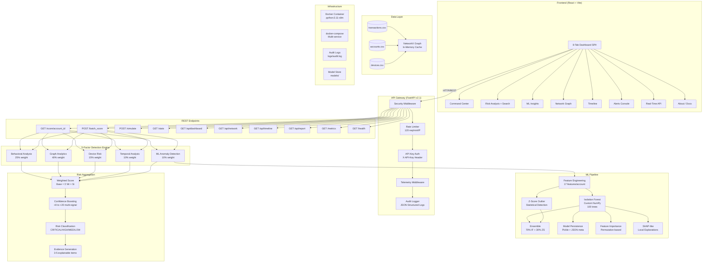
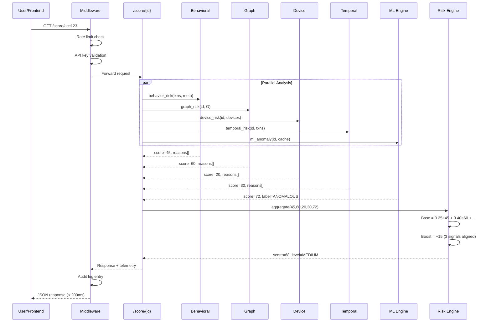
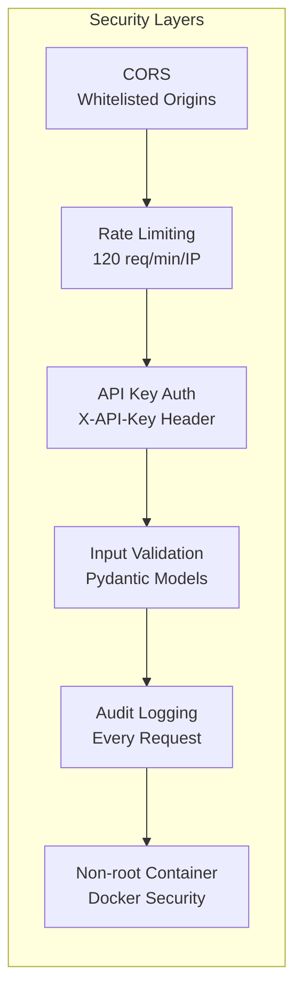

# UPI Mule Detection — System Architecture

## High-Level Architecture

## Data Flow — Single Account Scoring

## Security Architecture

## Technology Stack

| Layer | Technology | Purpose |
|-------|-----------|---------|
| **Frontend** | React 18 + Vite | SPA Dashboard |
| **Visualization** | Plotly.js, vis-network | Charts & Graph |
| **Backend** | FastAPI (Python 3.11) | REST API |
| **ML Engine** | Custom Isolation Forest (NumPy) | Anomaly Detection |
| **Graph** | NetworkX | Transaction Network Analysis |
| **Data** | Pandas + CSV | Data Processing |
| **Containerization** | Docker + Compose | Deployment |
| **Logging** | Structured JSON logs | Audit Trail |
